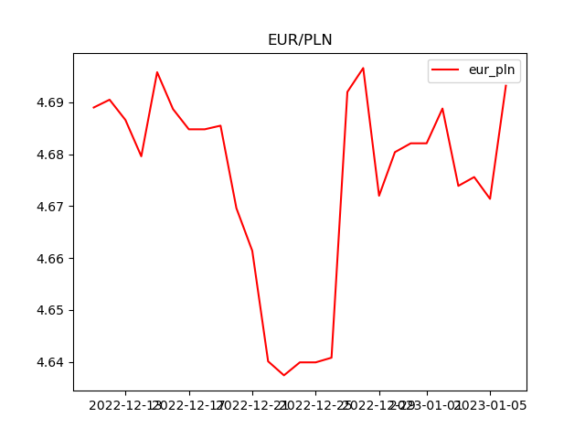
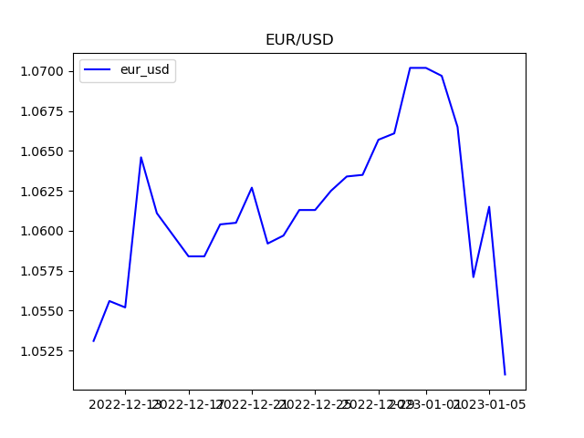
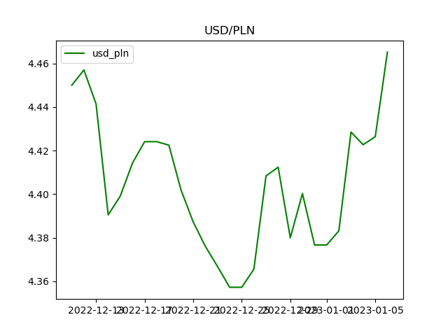

# Web Scraper
This repository contains a web scraper and data analysis script for extracting and visualizing currency exchange rates from the website [https://notowania.pb.pl](https://notowania.pb.pl). The web scraper is implemented using Scrapy, a popular web crawling and scraping framework for Python.

## Prerequisites
- Python 3.x
- Scrapy
- json_lines
- matplotlib
- numpy

## Installation

1. Install the required Python packages using the following command:
    ```bash
    pip install scrapy json_lines matplotlib numpy
    ```

## Usage

### 1. Web Scraper (SpiderSpider)

The web scraper (`SpiderSpider`) is designed to crawl the specified URLs on [https://notowania.pb.pl](https://notowania.pb.pl) and extract relevant information. To run the scraper, use the following command:

```bash
scrapy runspider src/spider.py -o ../data/currency.jl
```

This command will execute the scraper and store the extracted data in JSON Lines format (currency.jl).

# Data Analysis Script

To run the data analysis script, use the following command:

```bash
python data.py
```
This command will generate three line charts (eur_pln.png, usd_pln.png, and eur_usd.png) in the public directory.

## EUR/PLN

## EUR/USD

## USD/PLN
